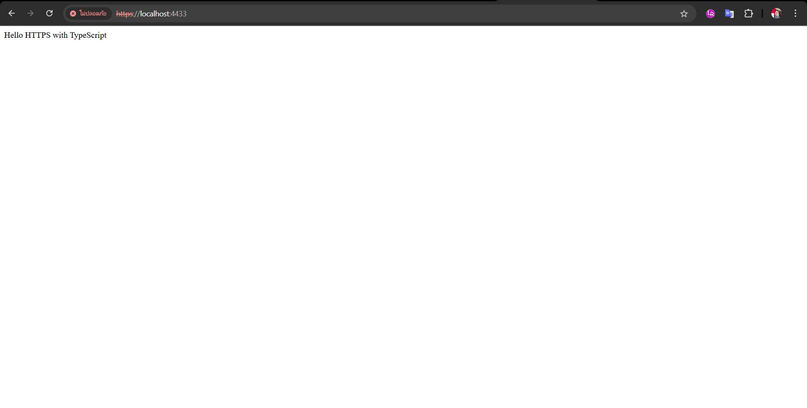

# LearnHttps
โปรเจคนี้ทำขึ้นเพื่อศึกษาการเขียน Server ให้สือสารผ่านโปรโตคอล HTTPS และเป็นโค๊ดตัวอย่างสำหรับโครงการในอนาคต

## Features
- รองรับการร้องขอจากอุปกรณ์ภายนอกทุก IP
- พัฒนาด้วยภาษา TypeScript
- ทำงานเป็น Web Server
- อัพเดตการทำงานทันทีเมื่อโค๊ดถูกแก้ไข

## Getting Started
1. Clone โปรเจกต์:
```bash
git clone https://github.com/NuttaScholar/LearnHttps.git
cd LearnHttps
```
2. ติดตั้ง dependencies
```bash
npm install
```
3. เริ่มเซิร์ฟเวอร์
```bash
npm run dev
```
## Example


## สร้าง Self-signed SSL Certificate
ในการสือสารผ่าน HTTPS จำเป็นต้องมี SSL Certificate ที่ออกโดยบุคคลที่3 ซึ่งมีข้อกำหนดว่าผู้ขอต้องมี Server domain ที่สามารถเข้าถึงได้ผ่าน Internet แต่ในการทดลองเราสามารถออก SSL Certificate ด้วยตัวเอง ที่เรียกว่า Self-signed SSL Certificate โดยมีขั้นตอนดังนี้
1. ติดตั้ง OpenSSL
ไปที่หน้า https://slproweb.com/products/Win32OpenSSL.html เลือกโหลดเวอร์ชันล่าสุด เช่น: Win64 OpenSSL v3.x.x Light (ถ้าเครื่องคุณเป็น 64-bit) แล้วทำการติดตั้ง
2. Set PATH
```
1. กด Windows + S แล้วพิมพ์ "environment variables"
2. เลือก Edit the system environment variables
3. คลิกปุ่ม Environment Variables
4. ใต้ "System variables" หรือ "User variables" → เลือกตัวแปรชื่อ Path → กด Edit
5. กด New แล้วใส่ path ของ OpenSSL เช่น C:\Program Files\OpenSSL-Win64\bin
6. กด OK ทุกหน้าต่างเพื่อบันทึก
```
3. ทดสอบ
ปิด PowerShell หรือ Terminal ที่เปิดอยู่ แล้วเปิดใหม่ แล้วลองพิมพ์
```bash
openssl version
```
ควรได้ผลลัพธ์ดังนี้
```
OpenSSL 3.x.x ...
```
4. สร้าง Self-signed SSL Certificate
รันคำสั่งต่อไปนี้ แล้วใส่ข้อมูลตามขั้นตอนเช่น country, organization ได้ตามสะดวก
```bash
openssl req -nodes -new -x509 -keyout cert/key.pem -out cert/cert.pem -days 365
```

## หากไม่เข้าใจคำอธิบาย
[](https://www.youtube.com/watch?v=a_ednwq0WKo)
 
